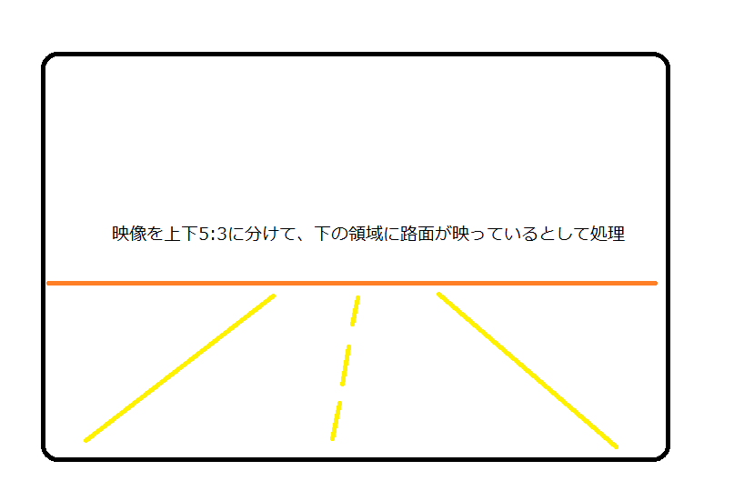
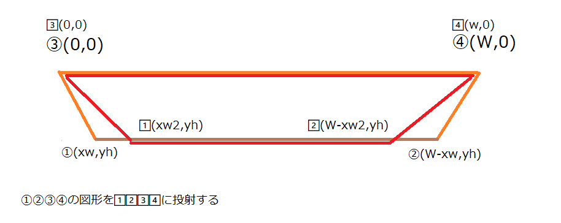

# rc-driver
ラジコンを自動運転する自動運転。
使い方などのメモはこちらのリンク参照。

https://qiita.com/t_kumazawa/private/7e735588dbf7d9c2bd24

## Bird's eye view Transformation

自動運転で鳥観図に変換するための方法。
あちこちのWebの記録をまとめた。
Pythonで処理を書く時のための備忘録。
画像は左上が(0,0)の原点になることに注意。

### 1.画像の中で路面が映っている領域を切り取る


映像を上下5:3に分けて、下の領域が変換の対象として処理する。
Y方向はH * 5/8 から Hの位置までが処理範囲で、X方向は0からWまでとする。

```
    H,W = cv_bgr.shape[:2]
    Hdiv = 5/8

    img = cv_bgr[H*5/8:H, 0:W]
```

### 2.投射変換用の行列を計算する



```
    xw = W * 0.0625
    xw2= W * 0.45
    yh = H * 0.3

    src = np.float32([[xw, yh], [W-xw, yh], [0, 0], [W, 0]])
    dst = np.float32([[xw2, yh], [W-xw2, yh], [0, 0], [W, 0]])
    M = cv.getPerspectiveTransform(src, dst)
```

変換に使う行列Mを得る。
その後、画像を変換してBird's eye viewを得る。

```
    transfer_img = cv.warpPerspective(img, M, (W, H))
```

## 物体検出

物体を検出して位置を検出し、その座標を投射変換行列Mで変換して画面にプロットする。


